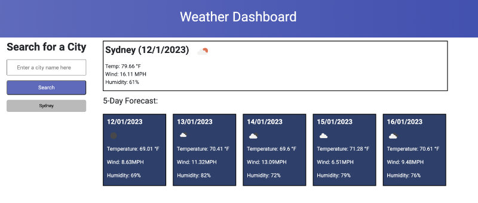
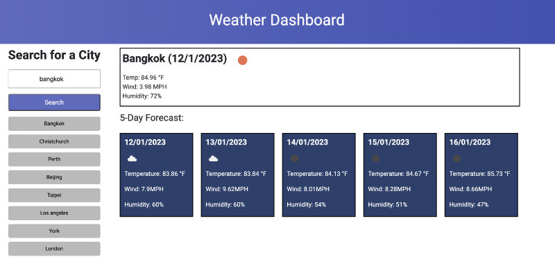
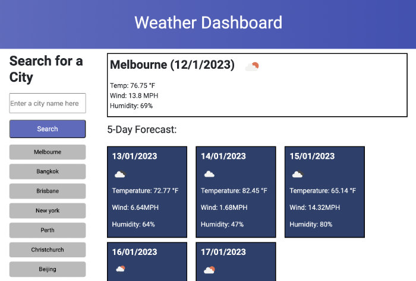
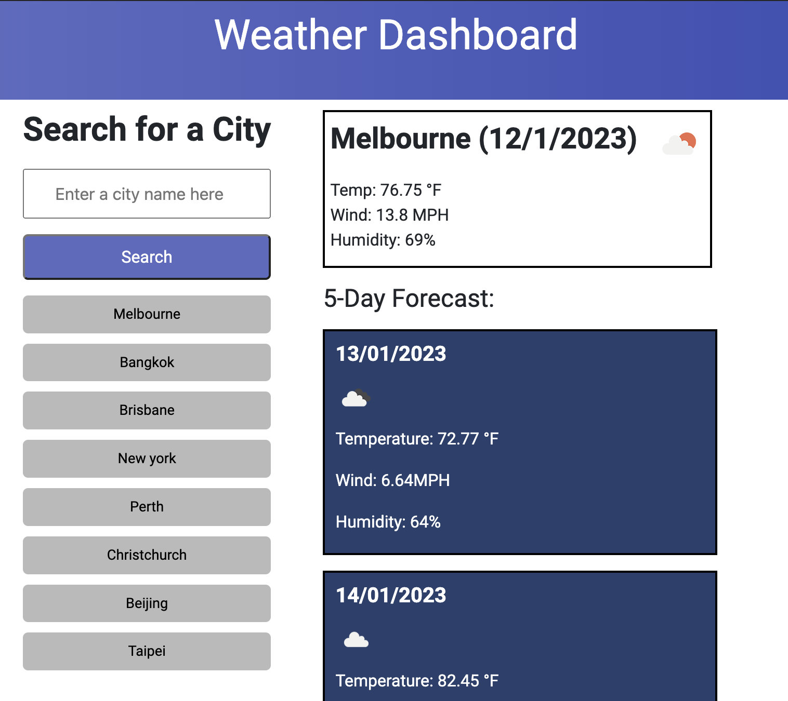
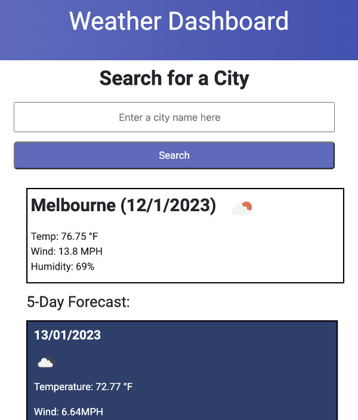

# Weather Dashboard - Weather Forecast by City

This weather dashboard web application provides current and 5-day forecast weather report of a city that a user searches for. Weather information provided includes:
- Weather icon, illustrating the weather condition
- Temperature (in Farenheit)
- Wind Speed (in miles per hour)
- % Humidity

## Technology Used
- HTML
- CSS
- JavaScript
- Google Fonts
- Day.js

## APIs
- OpenWeather Geocoding API
- OpenWeather Current Weather Data
- OpenWeather 5 day weather forecast API

## URLs
- [Deployed Application URL](https://jouriena11.github.io/weather-forecast-by-city-dashboard/)
- [GitHub Repository URL](https://github.com/jouriena11/weather-forecast-by-city-dashboard)

# Expected Behavior

When the website is loaded for the first time, it will fetch weather data of Sydney for default rendering.

    

The page is divided into 3 sections:
- Page Title
- Search Bar / Past Searches Button column on the left
- Weather reports rendering on the right

When a search query of a city name is submitted: 
- a button of the same city name would also be created below the 'Search' button
- current and forecasted weather reports would be fetched and rendered on the right column

    

The submitted city name will be saved in the localStorage and retrieved everytime the page is reloaded.

The button of the last searched city will be displayed at the top. By clicking on a past-search button, that particular city would become the last searched city and the corresponding button would be displayed at the top. The previously created button of the same name (which is down the past-search list) would also be removed as a result. Submitting a search query for the same city (by entering the city name in the search bar and clicking 'Search' button) would give the same result. In other words, users would not see the same city in the past search list. 

For visual aesthetics, the number of past-search buttons are capped at 8. In other words, the older searches would be removed from the list once the number of past-search button reaches 8.

This web application is 100% responsive.

    

This is how the website looks at 992px screen.

    

This is how the website looks at 768px screen.

    

This is how the website looks at 576px screen.

## Future Developments
- To apply Bootstrap to index.html for easier maintenance.
- To apply geolocation API instead of using Sydney as a default city to fetch weather data
- To make it possible for users to specify the time of the day for which they want to get the weather data